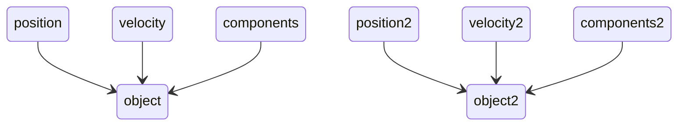
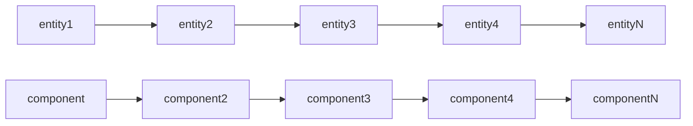
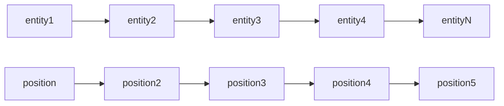
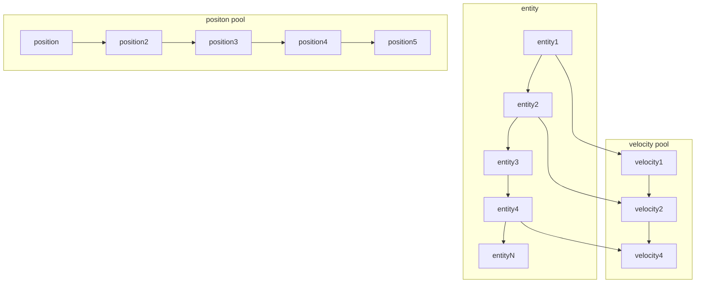
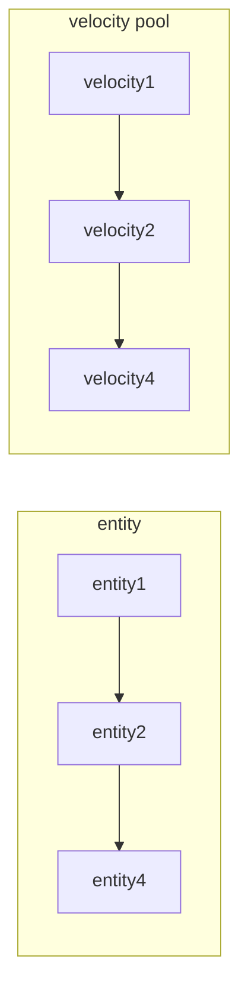
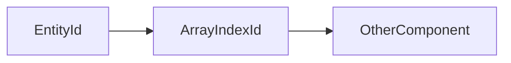

# Introduction 

This article will try to explain the deep understanding of ecs architecture, which include the memory model, how to do in multi-thread with look-free and abstract interface for developer.

# CPU-Cache

Before talking about ecs architecture, I will try to explain an important knowledge "CPU-Cache". 


The main purpose of CPU cache is to reduce the latency or delay in data retrieval. When the CPU needs to access data, it first checks whether the data is available in the cache. If the data is present in the cache (cache hit), the CPU can retrieve it much faster than if it had to fetch the data from the main memory (cache miss). This helps to mitigate the performance bottleneck caused by the slower access times of main memory.

There are typically three levels of CPU cache: L1, L2, and L3. These levels form a hierarchy with different sizes and access speeds:

The cache hierarchy is designed to exploit the principle of **spatial and temporal locality**, where programs tend to access data and instructions that are close to what they've accessed recently. By keeping frequently accessed data in the cache, the CPU can operate more efficiently and reduce the time spent waiting for data from main memory.

## Spatial and Temporal Locality
### Spatial Locality

Spatial locality refers to the tendency of a program to access data located near or close to the data that has been recently accessed. In other words, if a program accesses a particular memory location, it is likely to access nearby memory locations in the near future. This principle is rooted in the idea that data in memory is often stored in contiguous blocks, so accessing one piece of data often implies accessing neighboring data as well.
For example, when iterating over an array in a loop, spatial locality suggests that the next element to be accessed is likely to be stored in close proximity to the current element. Caches exploit spatial locality by fetching entire **cache lines (blocks of contiguous memory)** when a memory location is accessed. This way, if a program accesses one piece of data, it's likely to access other nearby data soon, improving cache hit rates.

### Temporal Locality
Temporal locality refers to the tendency of a program to access the same data or instructions repeatedly over a short period of time. In other words, if a piece of data is accessed once, it's likely to be accessed again in the near future. This principle is based on the observation that programs often exhibit repetitive behavior and reuse the same data multiple times within a short timeframe.
For instance, in a loop that processes the same data multiple times, temporal locality implies that the loop will repeatedly access the same data elements. Caches leverage temporal locality by keeping recently accessed data in the cache. If a piece of data is accessed once and stored in the cache, subsequent accesses to the same data can be served quickly from the cache.

## Who is Faster ?

Assuming there is a matrix(N x M), we have these two approaches to iterate. which one is faster?

```c++
for(int i = 0;i<N; I++)
      for(int j = 0;j<M; j++) 
             print(matrix[i][j]);
```

```c++
for(int i = 0;i<M; I++)
      for(int j = 0;j<N; j++) 
             print(matrix[j][i]);
```
### Iteration By Row
the answer is the **first one**. but why?  we use an example to explain. Look at the picture below. (ignored L3 cache.)

we use the first approch to iterate means iterating by row.

when the CPU wants to access matrix, it is not cache. so it would load a **cache line** into L2/L1.


now the cache line is mapped into L1/L2, the CPU can access matrix[N][0], matrix[N][1], matrix[N][2], etc quickly becuase they are in a contiguous block.

### Iteration By Column


but if we iterate matrix by column, in most cases the elements matrix[0][M] , matrix[1][M], and matrix[2][M] are not contiguous, which would cause a very high-frequency cache miss. Thus, the overall efficiency would be slower.

## ECS Architecture at First impression

The most obvious implementation of a component based model is the one that involves maps (or sort of) and objects taken directly from the typical OOP world

```markdown
void system(std::vector<GameObjects> &objects) {
    for(auto &object: objects) {
        if(object.has<position, velocity>()) {
            auto &pos = object.get<position>();
            auto &vel = object.get<velocity>();
            //handle your logic.
        }
    }
}
```

### Memory Model

In this example, so the memory looks like this. 



### Problems ?
- components are scattered around in memory and you’ve multiple jumps each and every time you access them.
   - you don’t know at any time what are the game objects that match a given query and thus you must iterate all of them in each system
   - thus, there is a big performance issue.


## ECS Architecture at Second impression

From the last example, we can see that **the GameObject** were nothing more than **containers** for components
- Components were stored in maps by game objects and every game object had its own set of components. 
   - Thus, It should be quite easy to get rid of these wrappers and change a bit the layout, so that components of a same type are stored together. it could look like this.


and then we can try to get rid of object and rename it to entity, becuase it is pointless. 



but there is a problem, not all entities have same components. thus there are some solutions to solve it.

### Code Appearance

ECS Architecture is totally different with OOP. so for each object, we can call it as **entity**, in this case it is only an integer for representing current object id and managed by central registry .
in order to accelerating accessing components data, each components would be storaged in a pools( continous memory block );

```c++
class Registry{

   entityId create(){....}

   template<Comp>
   Comp& emplace(Args&&...args){....}

   SparseSet<entity> entites;
};

template<Comp>
class StoragePool
{
   Comp[MAX_LENGHT] componts;
}
```


### Archetypes

The idea behind this approach can be summarized as follows: if an entity has a particular set of components, take the pool (also known as archetype) for the entities that have that same set (if it doesn’t already exist, create it) and assign the entity and all its components to that pool. Whenever you add/remove a component to/from an entity, pick up everything again and move the entity and all its components from a pool to the other, from an archetype to the other.


- How does archetypes solve the problem of finding all the entities that have certain components?
   - ***The triditional way*** is iterating all the entities and test them to know if they have the desired components.
   - ***The Archetype solution*** is iterating all the archetypes (much less than the entities), then return all the entities from the archetypes that are built for a set of components that contains at least the desired ones.
- What are the drawbacks ?
   - Every time a component is added or removed, an entity and all its components are moved from an archetype to another one. This affects to an extent the construction and destruction of components
   - Main issue is the archetypes's fragmentation. which means if you have a high number of possible combinations of components assigned to different entities at runtime and this will definitely affect the iterations to an extent by adding more and more jumps to find all the entities.

### Sparse Sets

It is different from Archetypes approach. Sparse sets is a clever data structure for storing sparse sets of integers on the range 0 .. u−1 and performing initialization, lookup, and insertion is time O(1) and iteration in O(n), where n is the number of elements in the set.
   - in short, the sparse set would provides two array. one is **dense[]**, another one is **sparse[]**.


the indirection isn’t required when you want to iterate all the values contained by the sparse set. It’s suffice to walk through the **dense** for that, from the first to the last.

how can we use the SpareSet to organize components? we can use the sparse set to create to pool and put components (look at the graph)


##### Problems

but there still are some problems, if we only iterate one component, that must be faster. but if we want to iterate entities which contain component **position** and **velocity**. How do we do?

### View

The first implementation is **view**. which also provies **single** type views and **multi-type** views.

#### Single Views
Single type views are specialized to give a performance boost in all cases. (that's because each components are in contious memory block and cache-friendly)

```c++
auto singleView = registry.view<position>();
```

There is nothing as fast as a single type view. They just walk through packed (actually paged) arrays of elements and return them directly.


#### Multi Type Views

Multi type views iterate entities that have at least all the given components. 

```c++
auto muiltView = registry.view<position,velocity>();
```


During construction, they look at the number of elements available in each pool and use the **smallest set** in order to speed up iterations.


The performance is good when you **only** fetch velocity component(because it was the smallest set). but the performance could cause slower when you try to access other components becuase it would use indirect look-up.



So is there any way to boost the performance when you want to iterate **more components**.


### Group

Consider you want to iterate components **position** and **velocity**. Because of the way sparse sets work, you know components are all tightly packed in two arrays. Both of them contain some entities that have both the components and some others that have only one of the components. If you can arrange things so that all the entities that have both the components are at the top of the arrays while all the others are at the end, as a result the components will also be arranged accordingly. Iterations will benefit indecently from how things are laid out in this case, because all the entities that have both the components and the components themselves are tightly packed and sort in the same way at the beginning of their arrays. 

