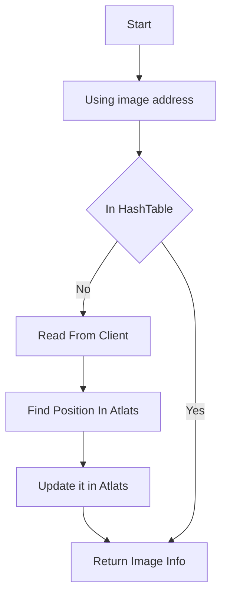
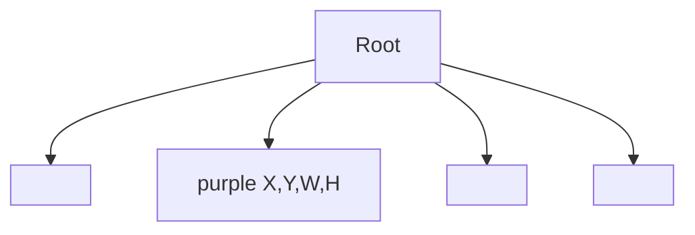
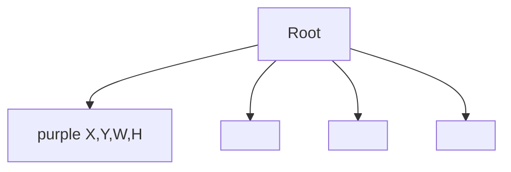
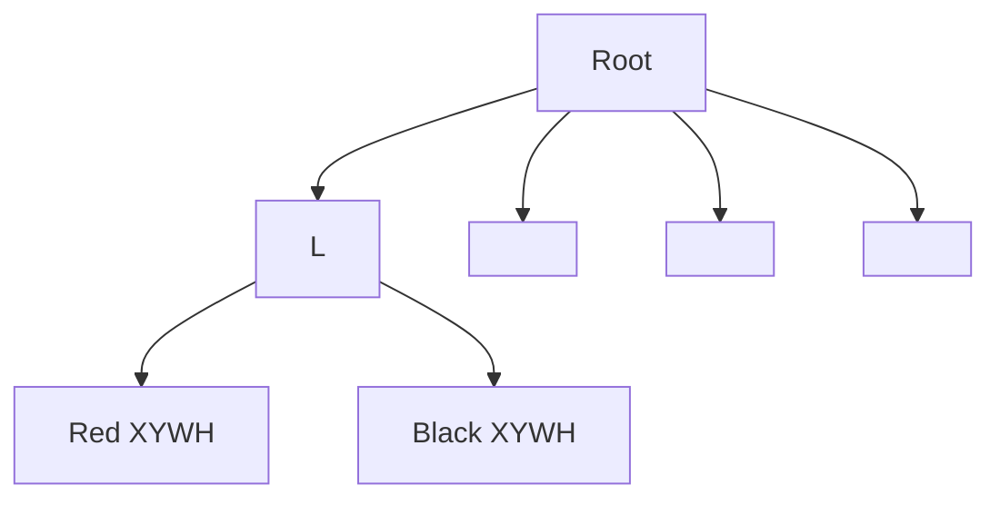

# Texture Management

Texture management is a key module of the engine. When you need to display a image, you need to use the image to create a texture. OpenGL can render the texture object and display the image. When using images, a Texture class is created and then managed.

## Texture Type

In my 2D game, there are three type of textures. RGBA4444 RGBA8888 RGB565

```c++
struct color4444
{
    uint8_t b : 4;
    uint8_t g : 4;
    uint8_t r : 4;
    uint8_t a : 4;
};

struct color8888
{
    uint8_t b;
    uint8_t g;
    uint8_t r;
    uint8_t a;
};

struct color565
{
    uint16_t b : 5;
    uint16_t g : 6;
    uint16_t r : 5;
};
```
when the engine load the texture, it will be converted into **Color8888** format.

## Data Structure

```c++
class Texture
{
    WzBitmap bitmap;//the address in client
	Vector2 origin;//origin 
	Vector2 dimensions;//width and height
    int16_t order;//z order
};
```
## How to manage it

In some engine like unity, when user/developer import many small textures. the engine will generate a big image and fill all images into the image. we call this process as pre-optimization


However,MapleStory did have pre-optimization process, the small texture distribute in client. in order to improve the usage of memory. we should do it at runtime.

### Manage with QuadTreee

Since MapleStory contains many small images, a map is composed of many small images, so you need to consider the fragmentation of memory, memory capacity, and the principle of batch rendering when rendering. Therefore, in order to improve efficiency, when OpenGL is initialized, two empty 4096*4096 textures (Atlas) need to be created first. When the texture needs to be loaded, the small textures are arranged to Atlas according to certain rules at runtime.


```c++
//describe every texture's releative positon in Atlas
struct Offset
{
  	GLshort l; //left
	GLshort r; //right
	GLshort t; //top
	GLshort b; //bottom
    GLint textId = 0;//Atlas Id
};
//TextureId -> Offset
std::unordered_map<size_t, Offset> offsets;
```

The cache id is **texture ID** in the current engine, and the loaded textures are all stored in the TexturePool.

### Loading process




### Arrangement of textures in Atlas

Because different textures have different sizes, textures cannot be arranged sequentially in Atlas. If you arrange in order (the first row is full, then the second row), the overall Atlas space utilization is relatively low, and the waste of memory is more obvious (as shown in the figure, the yellow space has been wasted)


### Implementation with QuadTree

The quadtree essentially divides the space, dividing the space into four quadrants up, down, left, and right (the four areas are not equal in width and height) 


Take the above image as an example: if we store in order (left, right, up and down), there will be empty areas, so the yellow areas will be divided

Before dividing, it needs to be defined:

* If the height of the following image is smaller than the height of the previous image during the process of mapping from left to right, then the difference is the empty space and inserted into the quadtree. (As shown in the purple area)




* If the height of the back image is greater than the height of the previous image during the process of mapping from left to right, then the difference is the empty space in front and inserted into the quadtree. (As shown in the purple area)




* If a image with an area smaller than the purple area is inserted into the purple area, and the extra space is inserted into the child node of the current node
For example, the red and black areas in the current image. Exception: If the length or height of the remaining area is less than the minimum node value, the current area is discarded




For the process, we can have a data structure

```c++
//叶子信息描述为
struct LeftOver
{
	GLshort l; //left
	GLshort r; //right
	GLshort t; //top
	GLshort b; //bottom
};

struct QuadTree
{
    
	enum Direction
	{
		LEFT,
		RIGHT,
		UP,
		DOWN
	};

    struct Node
	{
		int32_t value; //current Id
		LeftOver parent; //parent
		LeftOver left; //child;
		LeftOver right;
		LeftOver top;
		LeftOver bottom;
    };

    //in order to improve search effectiveness
    std::unordered_map<int32_t, Node> nodes;
};
```


### Define Node Direction

Utilize the free space of the index as much as possible in the quad tree, so it is necessary to check whether there is free space in the quad tree before inserting a image each time. Because the space can be divided into four spaces (up, down, left, and right), you need to confirm which space the current image should be inserted into when searching.

```c++
auto getDirection(const Left& first, const Left& second) -> Direction
{
    bool wComp = first.width() >= second.width();
    bool hComp = first.height() >= second.height();
    if (wComp && hComp)
    {
        return RIGHT;
    }
    if (wComp)
    {
        return DOWN;
    }
    if (hComp)
    {
        return UP;
    }
    return LEFT;
}
```

## Advantages and Disadvantages


### Advantages

Save memory, manage memory in batches, don’t worry about memory fragmentation

### Disadvantages

Occasionally, there will be a problem that the depth of the quad tree is too deep, the efficiency is slowed, and there is no texture reference count.

