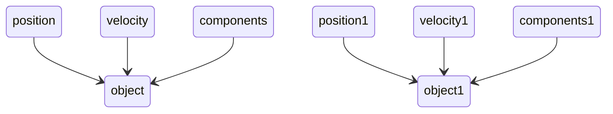

title: Advanced ECS Architecture
speaker: Tian
plugins:
    - echarts
    - mermaid
    - katex

<slide class="bg-black-blue aligncenter" image="https://docs.unity3d.com/Packages/com.unity.entities@0.51/manual/images/ECSBlockDiagram.png .drak">

# Advanced ECS Architecture {.text-shadow}
 
# {.text-intro}

[:fa-github: Github](https://github.com/flwmxd){.button.ghost}

<slide class="bg-black-blue slide-top">

:::{.content-left} 
### What is ECS

ECS(Entity-Component-System), its model follows the principle of combination over the inheritance. Each basic unit in the game is an entity, and each entity is composed of one or more components. , Each component only contains data representing its characteristics (that is, there is no method in the component).


<slide class="bg-black-blue slide-top">
:::{.content-left} 

## Entity

- An entity is just a conceptual definition, referring to a unique object in your game world, a collection of a series of components. In order to easily distinguish between different entities, an ID is generally used to represent it at the code level. All the components that make up this entity will be marked with this ID to make it clear which components belong to this entity. Since it is a collection of a series of components, it is completely possible to dynamically add a new component to the entity or remove the component from the entity at runtime

## Component

- A component is a collection of a bunch of data, which can be implemented using a structure in the C language. It has no method, that is, there is no behavior, it is only used to store state.

## System

- A system is a tool that operates on a collection of entities with one or more identical components. It has only behavior and no state, that is, it should not store any data.


<slide class="bg-black-blue slide-top">

:::{.content-left} 

## ECS Architecture at First glance

- The most obvious implementation of a component based model is the one that involves maps (or sort of) and objects taken directly from the typical OOP world

```markdown
void system(std::vector<game_objects> &objects) {
    for(auto &object: objects) {
        if(object.has<position, velocity>()) {
            auto &pos = object.get<position>();
            auto &vel = object.get<velocity>();
        }
    }
}
```

### What is the problem of above code?
- components are scattered around in memory and you’ve multiple jumps each and every time you access them.
   - you don’t know at any time what are the game objects that match a given query and thus you must iterate all of them in each system
   - thus, there is a big performance issue.


<slide class="bg-black-blue slide-top">

:::{.content-left} 

# Architecture evolution

In the previous example, game objects were nothing more than containers for components. so the memory looks like this. 

- Components were stored in maps by game objects and every game object had its own set of components. the issue is there is a big ***performance issue*** 

   - Thus, It should be quite easy to get rid of these wrappers and change a bit the layout, so that components of a same type are stored together. This is also the next step along the path.



<slide class="bg-black-blue slide-top">

# Architecture evolution

## Archetypes

The idea behind this approach can be summarized as follows: if an entity has a particular set of components, take the pool (also known as archetype) for the entities that have that same set (if it doesn’t already exist, create it) and assign the entity and all its components to that pool. Whenever you add/remove a component to/from an entity, pick up everything again and move the entity and all its components from a pool to the other, from an archetype to the other.

Here is an picture demo.

<slide class="bg-black-blue slide-top">

# Architecture evolution

- How does archetypes solve the problem of finding all the entities that have certain components?
   - ***The triditional way*** is iterating all the entities and test them to know if they have the desired components.
   - ***The Archetype solution*** is iterating all the archetypes (much less than the entities), then return all the entities from the archetypes that are built for a set of components that contains at least the desired ones.
- What are the drawbacks ?
   - Every time a component is added or removed, an entity and all its components are moved from an archetype to another one. This affects to an extent the construction and destruction of components
   - Main issue is the archetypes's fragmentation. which means if you have a high number of possible combinations of components assigned to different entities at runtime and this will definitely affect the iterations to an extent by adding more and more jumps to find all the entities.

<slide class="bg-black-blue slide-top">
# Sparse sets

- Lets see how **sparse sets** work and what can we do in **sparse set**.

   - a clever data structure for storing sparse sets of integers on the range 0 .. u−1 and performing initialization, lookup, and insertion is time O(1) and iteration in O(n), where n is the number of elements in the set.
   - in short, the sparse set would provides two array. one is **dense[]**, another one is **sparse[]**.

- there is a case if we use **vector\<T\>** to store components. when you remove some components, resize or shrinks might not be good because it could case performance issue.  but if we use another array to index the empty space, it can avoid this problem.

<slide class="bg-black-blue slide-top">
# Query

